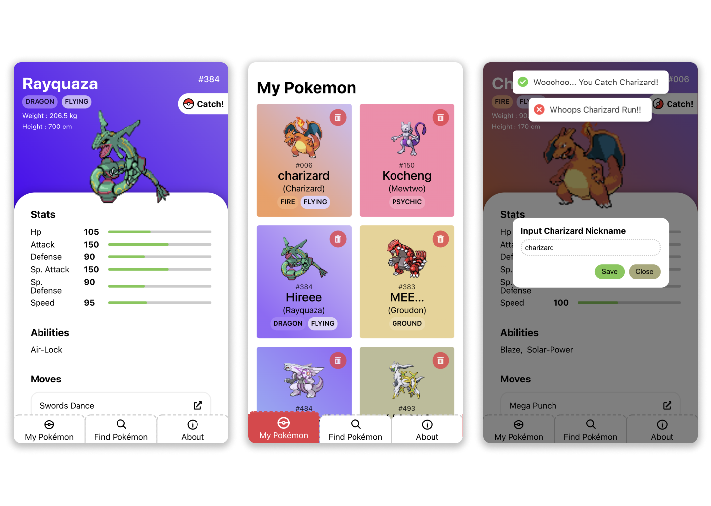

# A Pokemon app

<p align="center">
  
</p>

<p align='center'>
A simple pokedex web app built with react.js & typescript made by <a href='https://LRMN.is-a.dev'>L RMN</a>.
</p>

<p align="center">
  
</p>

## Run Locally

### Prerequisite

- [Node.js](https://nodejs.org/)
- [yarn](https://yarnpkg.com/getting-started/install) (recommended)

Clone the project

```bash
  git clone https://github.com/pokemon/
```

Go to the project directory

```bash
  cd pokemon
```

Install dependencies

```bash
  yarn
```

Start the development server

```bash
  yarn start
```

Open http://localhost:3000 with your browser to see the result.

## Running test

```bash
yarn test
```

## Github Actions

This project has a github actions scripts to run `yarn test` & lighthouse assertion, see it in [**_actions_**](https://github.com/pokemon/actions) (ha! get it?).

## Built Using

- [Create React App](https://create-react-app.dev/) to initialize the project.
- [Emotion.sh ⚡](https://emotion.sh/) css-injs.
- [Apollo](https://www.apollographql.com/docs/react/get-started/) graphql client.
- [mazipan/graphql-pokeapi](https://github.com/mazipan/graphql-pokeapi) for graphql api.
- [Workbox ⚙️](https://developers.google.com/web/tools/workbox/modules/workbox-strategies) for creating service worker.
- [Statically.io ⚡⚡⚡](https://statically.io/) assets CDN.
- [Jest](https://jestjs.io/) & [react testing-library](https://testing-library.com/) for testing.
- Written in [typescript](https://typescriptlang.org).
- [Hosted on Vercel 🚀](https://vercel.com/).


## Feedback

If you have any feedback or issues, you can submit it [here](https://github.com/pokemon/issues).

## License

This project licensed under [MIT License, Copyright (c) 2021 L RMN](./LICENSE)

**_Pokémon © 2002-2021 Pokémon. © 1995-2021 Nintendo/Creatures Inc./GAME FREAK inc. TM, ® and Pokémon character names are trademarks of Nintendo._**
